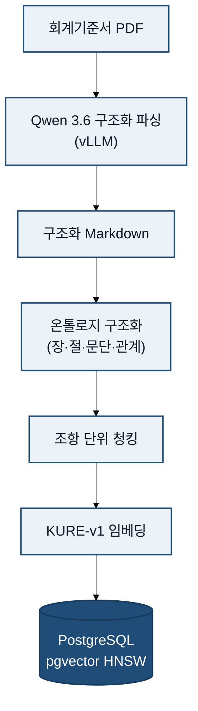
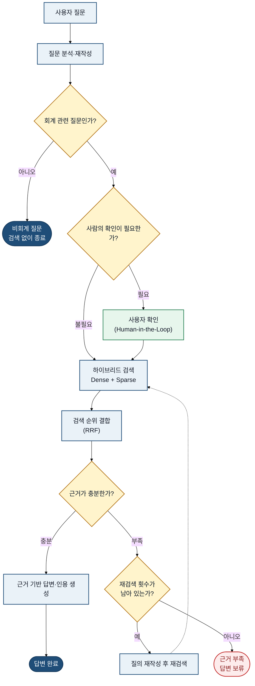

# 회계기준서 RAG 시스템

한국 일반기업회계기준(K-GAAP)에서 질문과 관련된 조항을 검색하고, 근거 조항과 함께 답변하는 RAG(Retrieval-Augmented Generation) 시스템입니다.

## 0.🎬 데모

아래는 실제 화면 녹화입니다. 세 가지 상황 — 기본 질의, 사람 확인, 근거가 없을 때의 처리 — 을 보여줍니다.

**① 기본 질의** — 질의를 입력하면 관련 기준서 조항을 먼저 찾아 보여주고, 그 조항을 근거로 답변과 인용을 제시합니다.


**② 사람 확인(HIL)** — 질의가 여러 주제로 쪼개질 만큼 복잡하면, 검색에 들어가기 전에 재작성 전략을 사람이 직접 확인하고 승인합니다.


**③ 정직한 거절** — 기준서에서 충분한 근거를 찾지 못하면, 답을 지어내지 않고 확정적으로 답할 수 없음을 알립니다.


<!--
고화질 MP4: GitHub 웹 편집기(또는 이슈 코멘트)에 docs/assets/demo-*.mp4 를 드래그 업로드하면
발급되는 첨부 URL로 아래처럼 넣을 수 있습니다.
<video src="https://github.com/user-attachments/assets/…" controls width="720"></video>
-->

## 1. 왜 이 프로젝트를 만들었는가

CPA 시험은 K-IFRS를 중심으로 출제되지만, 감사 현장에서는 일반기업회계기준(K-GAAP)을 적용하는 기업을 자주 접합니다.
60기 합격자 단체방의 질문을 조사한 결과 K-GAAP 관련 질의가 반복적으로 확인되었고, 'LLM에게 질의->직접 기준서 원문 확인'의 비효율적인 과정을 거쳐야하며, 그 과정에서 hallucination이 자주 발생함을 이야기했습니다.

이 프로젝트는 질문과 관련된 기준서 조항을 검색하고, 답변과 원문 근거를 함께 제공하여 이러한 탐색과 검증 과정을 줄이는 것을 목표로 합니다.

## 2. 구현 범위

### 현재 범위

- K-GAAP 질문과 관련된 핵심 조항을 검색하고, 답변과 함께 제공합니다.
- 검색 근거가 부족하면 무리하게 답변하지 않고 재검색하거나 답변 불가를 반환합니다.
- CLI, 웹, MCP가 동일한 LangGraph 워크플로를 사용합니다.

### 현재 범위가 아닌 것

- PDF 원문 뷰어 코드는 구현되어 있으나, 검증이 완료되지 않아 현재는 사용불가
- K-IFRS와 K-GAAP의 자동 비교(차이 비교 파일은 구비 완료)
- 대규모 동시 사용자를 위한 클라우드 서비스 운영

## 3. 설계 원칙

이 프로젝트는 다음 세 원칙을 기준으로 기술을 선택했습니다.

1. **답변 품질보다 근거 조항 검색을 먼저 평가합니다.**
2. **회계기준의 장·절·문단 구조와 출처를 청크에 보존합니다.**
3. **가능하면 기술은 도입 전에 동일한 평가셋에서 측정하고, 기준을 넘지 못하면 도입하지 않습니다.**
    예: 리랭커, Sparse 검색, BM25

## 4. 전체 아키텍처

시스템은 문서를 검색 가능한 형태로 만드는 적재 경로와, 사용자의 질문에 답하는 질의 경로로 나뉩니다.

### 문서 적재



### 질의 처리



메인 workflow는 `rewrite → search → rerank → evaluate → generate` 순서로 실행됩니다. `rerank` 단계는 파이프라인에 존재하지만 실험에서 품질 저하가 확인되어 기본값은 비활성화되어 있습니다. [아래에 자세하게 기술되어 있습니다.](#61-graph-db-중심-graphrag)

## 5. 주요 기술 의사결정

### 5.1 PDF 파서

#### 배경

회계기준서는 제목, 문단 번호, 텍스트, 표 등의 데이터를 포함합니다. 텍스트만 추출하면 위계 구조를 잃어버리고, 검색 결과를 원본 문단과 연결하기 어렵습니다.

#### 결정

최초에는 Docling을 사용해 PDF 파싱을 진행했습니다. 하지만 헤더를 기반으로 위계 구조를 나누려고 한 계획과 달리 제목과 문단 번호 등의 헤더를 정확히 인식하는데 어려움이 있어서 추론 능력을 향상 시킬 필요가 있었습니다.
외부 GPU 서버를 활용할 수 있는 환경이 마련되어 vLLM으로 Qwen3.6-35B-A3B를 구동하고, PDF 내용을 헤더 위계가 반영된 구조화 Markdown으로 변환했습니다.

#### 결과와 한계

- PDF를 각 장마다 하나의 Markdown 데이터로 변환하고, 페이지 정보, 위계구조 등을 나타내었습니다.
그럼에도 불구하고 헤더 위계가 부정확한 결과는 PDF의 시각적 구조를 기준으로 헤더를 판정하는 검수·수정 기준을 Claude Code의 [`SKILL.md`](https://github.com/PDW-accountant/claude-agent-engineering/blob/main/skills/heading-correction/SKILL.md#L7-L38)에 명문화하고, 해당 지침에 따라 재검수했습니다.
- 복잡한 레이아웃, 폐지된 조문는 자동 변환만 신뢰하지 않고 별도 검증 규칙을 적용해야 했습니다.

### 5.2 온톨로지 기반 문서 구조화와 청킹

#### 배경

고정된 글자 수로 기준서를 나누면 하나의 조항이 여러 청크로 끊기거나, 서로 다른 조항이 하나의 청크에 섞일 수 있습니다. 또한 회계기준서에는 다른 조항의 참조, 적용 제외, 예외 조건이 반복적으로 등장하므로 텍스트만 저장해서는 조항 간 관계를 표현하기 어렵습니다.

이 프로젝트는 K-GAAP에서 출발하되, 향후 K-IFRS로 데이터베이스를 확장해 두 기준의 조항·개념을 비교하는 것을 목표로 설계했습니다. 이를 위해서는 장·절·항 구조와 조항 간 관계를 하나의 데이터 모델로 표현해 두 기준에 동일하게 적용할 수 있어야 했습니다.

온톨로지를 구현하는 방법으로는 RDFS·OWL을 이용해 개념과 관계를 정의하고, RDF 데이터를 JSON-LD로 표현하는 표준 방식이 있습니다. 다만 프로젝트 초기에는 범용적인 지식 교환이나 논리 추론보다, K-GAAP의 장·절·항 구조와 조항 간 관계를 제대로 추출할 수 있는지 먼저 확인하는 것이 중요했습니다. 관계 유형과 참조 해소 규칙도 계속 수정되는 단계였기 때문에, K-GAAP에서 직접 정의한 구조로 추출 규칙의 유효성을 먼저 검증한 뒤, K-IFRS로 확장하는 단계에서 표준 스택(RDFS·OWL·JSON-LD)을 적용해 두 방식을 비교하는 순서가 검증 범위를 통제하는 데 유리하다고 판단했습니다.

#### 결정

먼저 회계기준서의 구조에 맞는 경량 온톨로지를 직접 구현했습니다. [Pydantic 모델로 노드와 엣지 구조를 정의](src/db/ontology/models.py#L13-L76)하고, 결과를 [검수하기 쉬운 JSON으로 저장](src/db/ontology/builder.py#L70-L72)했습니다. 이를 통해 관계 추출과 참조 해소 과정을 직접 확인하면서 도메인 모델을 수정할 수 있도록 했습니다.

[Markdown의 헤더를 장·절·항·문단 노드로 변환하는 파서](https://github.com/PDW-accountant/rag_for_accounting/blob/main/src/db/ontology/md_parser.py#L36-L57)로 문서를 Standard → Section → Subsection 노드로 변환하고, 다음 관계를 엣지로 표현했습니다.

- `CONTAINS`: 장·절·항의 위계 관계
- `REFERENCES`: 다른 장·절·항·문단을 참조하는 일반 관계(이 장의 제1절 ‘공통사항’의 문단 6.4를 따른다.)
- `EXCLUDES`: 해당 장·절·항·문단의 적용범위에서 제외되어 다른 장·절·항·문단을 따르는 관계(ex : 제2절 ‘유가증권’의 적용대상 금융자산은 제외)
- `HAS_CONDITION`: 특정 조건에서만 적용되는 관계(ex : 만기까지 보유할 적극적인 의도와 능력이 있는 경우에는 만기보유증권으로 분류)
- `IS_DEFAULT_FOR`: 다른 절에서 정하지 않은 사항에 적용되는 보충 관계(ex: 제2절~제4절에서 정하지 않은 사항은 이 절에서 제시하는 원칙을 적용한다.)

위계 관계(`CONTAINS`)는 헤더 구조를 이용해 생성했습니다. 의미 관계(`REFERENCES`, `EXCLUDES`, `HAS_CONDITION`, `IS_DEFAULT_FOR`)는 회계기준서를 검토한 결과 일정한 패턴을 발견해 `다만`, `제외`, `제N절`, `문단 X.X` 등으로 [후보 문장을 먼저 선별](src/db/ontology/edge_detector.py#L12-L32)한 뒤, [LLM으로 관계 유형과 참조 대상을 추출](src/db/ontology/edge_extractor.py#L111-L165)하여 불필요한 호출을 줄였습니다.

추출된 `문단 6.4`, `제2절` 등의 참조 문자열은 [Resolver](src/db/ontology/resolver.py#L121-L229)에서 실제 노드 ID로 변환했습니다. 문단 범위와 `실`·`결` 접두어를 구분했으며, 연결하지 못한 참조는 삭제하지 않고 `unresolved_target`으로 남겨 후속 검수가 가능하도록 했습니다. 관계 추출부터 참조 해소까지는 [하나의 온톨로지 구축 파이프라인으로 통합](https://github.com/PDW-accountant/rag_for_accounting/blob/main/src/db/ontology/builder.py#L1-L69)했습니다([구축 커밋](https://github.com/dongtan-91-dong-welfare-center/rag_for_accounting/commit/dc8a4168aa73849a617029da301069551dcb4b9d), [테스트 커밋](https://github.com/dongtan-91-dong-welfare-center/rag_for_accounting/commit/e74a15bd33b626facad4b8cd4b0e3d92523ceb65)).

이 선택은 RDF·OWL 같은 표준 방식을 포기한 것이 아니라 단계적으로 검증하기 위한 결정입니다. 먼저 직접 만든 구조로 관계 유형과 추출 규칙의 유효성을 확인하고, 향후 K-IFRS 데이터베이스를 확장할 때 동일한 데이터를 JSON-LD·RDF 방식으로도 표현하여 관계 탐색, 데이터 검증, 유효성과 운영 복잡도를 비교할 계획입니다.

#### 청킹 적용

본문이 포함된 온톨로지 노드를 기본 청킹 단위로 사용하고, 각 청크에 ontology_node_id를 저장했습니다. 토큰 한도를 초과하는 노드만 문단, 문장, 문자 경계 순서로 추가 분할했습니다. 같은 문서를 다시 적재해도 [동일한 `chunk_id`를 생성](src/db/ontology/chunker.py#L196-L200)하고, [기존 데이터를 갱신하는 방식](src/db/vector_store.py#L90-L103)으로 중복을 방지했습니다.

#### 검증과 한계

이를 통해 검색 청크와 기준서의 위계 구조를 연결하고, 검색된 조항이 참조하거나 제외하는 다른 조항까지 추적할 수 있게 했습니다. 다만 의미 관계는 LLM을 이용해 추출하므로 회계적 의미가 중요한 엣지는 별도의 검수가 필요합니다. 관계 유형 충돌(ex: REFERENCES와 EXCLUDES 동시 발생), 중복 엣지, 미해소 참조 등은 재검수하였습니다.

### 5.3 임베딩: KURE-v1 자체 호스팅

#### 배경

한국어 회계 문장을 검색해야 하므로 한국어 검색 성능, 모델 라이선스, API 비용과 운영 환경을 함께 고려해야 했습니다.

#### 결정

한국어 회계 용어를 검색하기 위해 multilingual-e5-large, OpenAI text-embedding-3-small 등의 모델을 검토했습니다. 최종적으로 한국어 검색에 특화되어 있고 MIT 라이선스로 자체 호스팅할 수 있는 KURE-v1을 선택했습니다.
운영 환경에서는 KURE-v1을 TEI 컨테이너로 분리했습니다. 앱은 TEI의 /embed와 /tokenize API를 호출하므로 무거운 임베딩 모델을 직접 로드하지 않습니다. 또한 인덱싱과 질문 검색이 동일한 embed_texts()를 사용해 같은 모델과 1,024차원 벡터를 유지했습니다.

#### 결과와 한계

- 외부 임베딩 API 호출 비용 없이 인덱싱과 검색 단계에서 동일 모델을 사용할 수 있습니다.
- 앱과 임베딩 모델을 분리했습니다.
- 첫 모델 로딩과 메모리 사용량이 크기 때문에 warm-up, 배치 크기와 OOM 대응이 필요합니다.
- 모델 선택 시 정량 비교 실험은 진행하지 않았습니다.

### 5.4 저장소: PostgreSQL + pgvector HNSW

#### 배경

초기에는 Apache AGE 기반 GraphRAG와 Milvus·Qdrant 같은 전용 벡터 DB를 검토했습니다. 그러나 회계기준서의 참조 관계는 대부분 1~2 hop 이내여서 별도의 그래프 DB를 운영할 필요성이 크지 않았습니다.

또한 소규모 프로젝트에서 PostgreSQL과 전용 벡터 DB를 함께 운영하면 배포와 장애 관리 대상이 늘어납니다. 이에 따라 PostgreSQL + pgvector 단일 스택을 선택했습니다.

#### 결정

PostgreSQL 한 인스턴스에서 다음 데이터를 관리합니다.

- pgvector HNSW를 이용한 Dense 벡터 검색
- PostgreSQL FTS를 이용한 Sparse 검색
- 청크 본문과 ontology_node_id 등의 메타데이터

벡터 검색에는 [새로운 청크를 계속 추가할 수 있는 HNSW 인덱스](https://github.com/PDW-accountant/rag_for_accounting/blob/main/src/db/vector_store.py#L36-L65)를 사용하고, [문장 간 유사도는 코사인 거리로 계산](https://github.com/PDW-accountant/rag_for_accounting/blob/main/src/db/vector_store.py#L217-L234)했습니다.

#### 저장 방식

청크의 [원문과 임베딩 벡터](https://github.com/PDW-accountant/rag_for_accounting/blob/main/src/db/vector_store.py#L52-L58), [`ontology_node_id`와 출처 정보](https://github.com/PDW-accountant/rag_for_accounting/blob/main/src/db/ontology/chunker.py#L170-L208)를 [PostgreSQL에 함께 저장](https://github.com/PDW-accountant/rag_for_accounting/blob/main/src/db/vector_store.py#L91-L116)했습니다. 이를 통해 검색된 청크가 원래 어떤 온톨로지 노드에서 만들어졌는지 추적할 수 있도록 했습니다.

#### 결과와 한계

- 인프라 구성과 로컬 실행이 단순해졌습니다.
- 벡터와 키워드 검색에 동일한 메타데이터 필터를 적용할 수 있습니다.
- 현재 Sparse 검색은 BM25가 아니라 `to_tsvector('simple') + ts_rank_cd`입니다.
- PostgreSQL 기본 FTS는 한국어 형태소와 복합명사 처리에 한계가 있습니다.
- 현재는 벡터 검색으로 관련 청크를 찾는 단계까지만 구현되어 있습니다. 검색된 청크의 ontology_node_id로 JSON 그래프에 진입하고, to_id 관계를 따라 관련 조항을 추가로 가져오는 그래프 검색은 아직 구현하지 않았습니다.

### 5.5 검색 결합: 점수 가중합 대신 RRF

#### 배경

Dense 검색의 코사인 유사도와 Sparse 검색 점수는 분포와 범위가 다릅니다. 두 점수를 그대로 더하면 정규화 방식과 가중치에 결과가 민감해집니다.

#### 결정

각 검색 결과의 점수 대신 순위를 사용하는 RRF(Reciprocal Rank Fusion)로 결과를 결합했습니다.

```text
RRF score(document) = Σ 1 / (k + rank)
```

현재 `k=60`을 사용합니다. Dense와 Sparse 검색 중 한쪽이 실패하더라도 하나의 검색 결과로도 계속 진행하도록 구성했습니다.

#### 결과와 한계

- 서로 다른 점수 체계를 별도 정규화 없이 결합할 수 있습니다.
- 현재 Sparse 결과가 비어 있는 질의가 많아 일부 평가에서는 RRF가 사실상 Dense 순위를 그대로 사용했습니다.
  질의에 사용되는 용어가 기준서 용어와 달라서 그런 것으로 예측 중이고, XBRL taxonomy와 동의어 사전을 통해 rewrite 단계를 고도화할 계획에 있습니다.

### 5.6 워크플로: DeepAgent 대신 LangGraph StateGraph

#### 배경

회계기준 질의는 답변 단계와 실패 조건이 비교적 명확합니다. 자유도가 높은 에이전트는 다양한 도구를 선택할 수 있지만, 호출 횟수와 비용, 지연시간을 예측하기 어렵습니다.

#### 결정

LangGraph의 고정 StateGraph로 워크플로를 구성했습니다.

- [복합 질의(`decompose`)와 추상화가 필요한 질의(`stepback`)에만 사용자 확인을 요청하는 Human-in-the-Loop](https://github.com/PDW-accountant/rag_for_accounting/blob/main/src/agent/workflow.py#L127-L163)
- [근거가 부족하면 질의를 재작성하는 CRAG 보정 루프](https://github.com/PDW-accountant/rag_for_accounting/blob/main/src/agent/workflow.py#L334-L373)
- [타임아웃과 재귀 한도 초과 시 구조화된 실패 응답](https://github.com/PDW-accountant/rag_for_accounting/blob/main/src/agent/workflow.py#L479-L565)
- [중간 상태를 공유하는 Pydantic `GraphState`](https://github.com/PDW-accountant/rag_for_accounting/blob/main/src/models/state.py#L15-L48)

#### 결과와 한계

- 노드별 입력, 출력과 예외 경로를 추적할 수 있어서 흐름을 예측하기 쉽습니다.
- [HIL 체크포인터는 프로세스 메모리의 `MemorySaver`에 저장](https://github.com/PDW-accountant/rag_for_accounting/blob/main/src/agent/workflow.py#L451-L459)되므로, 서버를 재시작하면 세션이 사라지고 다중 워커 간에도 세션 상태를 공유할 수 없습니다.

### 5.7 질의 재작성 전략

#### 배경

사용자의 질문을 그대로 검색하면 회사명·금액처럼 지나치게 구체적인 표현이나 여러 회계 쟁점이 섞인 질문 때문에 관련 조항을 놓칠 수 있습니다. 비회계 질문에도 불필요한 검색이 실행되는 문제도 있었습니다.

#### 결정

초기에는 회계 여부를 LLM으로 분류하고 정규식으로 전략을 선택했지만, 표현이 다양한 질문에서 오탐이 발생했습니다. 이에 회계 여부와 전략 선택을 [한 번의 LLM 호출로 통합](https://github.com/PDW-accountant/rag_for_accounting/blob/main/src/agent/nodes/rewrite.py#L79-L107)하고, 판단 결과에 따라 다음 전략을 적용했습니다.

- 일반적인 회계 질문은 [HyDE로 가상 답변을 생성](https://github.com/PDW-accountant/rag_for_accounting/blob/main/src/agent/nodes/rewrite.py#L130-L151)
- 여러 회계 쟁점이 포함된 질문은 [Decompose로 하위 질문으로 분해](https://github.com/PDW-accountant/rag_for_accounting/blob/main/src/agent/nodes/rewrite.py#L154-L174)
- 회사명·금액·날짜 등이 포함되어 지나치게 구체적인 질문은 [Step-back으로 일반 원칙 질문으로 변환](https://github.com/PDW-accountant/rag_for_accounting/blob/main/src/agent/nodes/rewrite.py#L177-L197)
- 비회계 질문은 검색을 진행하지 않고 bypass
- LLM 호출이 실패하면 원문 질문만 사용하도록 폴백

전략별 판단 기준과 출력 형식은 [프롬프트에 명시](https://github.com/PDW-accountant/rag_for_accounting/blob/main/src/agent/prompts.py#L47-L118)했습니다. 전략 선택과 폴백 동작은 [단위 테스트](https://github.com/dongtan-91-dong-welfare-center/rag_for_accounting/commit/338de51a9608a95a5d733999f36d2dd8f9bf84dd)와 [실무 회계 질의 18건의 통합 테스트](https://github.com/dongtan-91-dong-welfare-center/rag_for_accounting/commit/44e3b56a2a3fc7fdfb9ed4b5f36328985bb1d47b)로 확인했습니다([초기 구현 커밋](https://github.com/dongtan-91-dong-welfare-center/rag_for_accounting/commit/3d4badff62a06e87f17a5d4d160e660791fa8cb6), [PR #21](https://github.com/dongtan-91-dong-welfare-center/rag_for_accounting/pull/21)).

#### 결과와 한계

- 검색 단계에 원문 질문과 재작성된 질문을 함께 전달할 수 있게 되었으며, LLM 호출에 실패하더라도 원문 질문으로 검색을 계속할 수 있습니다.
- 현재 sparse 검색이 정상적으로 작동되지 않는 오류가 있는데 질의와 기준서가 사용하는 용어가 다른 이유가 큰 것으로 생각됩니다. XBRL Taxonomy를 기반으로 기준서 용어를 추출하고, 이를 통해 동의어 사전을 만들어서 질의를 더 정교하게 재작성하는 방식을 추후 적용할 예정입니다.

### 5.8 사용자 인터페이스: Streamlit에서 FastAPI + React로 전환

#### 배경

초기 Streamlit 화면은 빠른 시제품 제작에는 적합했지만, API 계약, HIL 재개, PDF 원문 확인과 여러 클라이언트의 재사용을 확장하기 어려웠습니다.

#### 결정

FastAPI 백엔드와 React 프론트엔드로 전환했습니다. 앱 컨테이너가 API와 빌드된 React 정적 파일을 함께 제공합니다.

#### 결과와 한계

- 웹에서 답변보다 검색 조항을 먼저 확인할 수 있습니다.
- 인용 조항의 원본 PDF 페이지를 열 수 있습니다.
- CLI, Web, MCP가 동일한 LangGraph 워크플로와 응답 계약을 재사용합니다.

### 5.9 데이터 정책: BYO Corpus

회계기준 원문과 파싱·온톨로지 산출물은 소스 코드와 분리합니다. 공개 저장소에는 가이드라인과 최소 예시만 두고, 사용자가 자신의 실행 환경에 원문과 파생 데이터를 준비하는 BYO(Bring Your Own) 방식을 사용합니다.

이 정책은 소스 코드의 MIT 라이선스가 회계기준 원문과 파생 데이터에도 그대로 적용되는 것으로 오해하지 않도록 하기 위한 목적도 있습니다.

## 6. 실험으로 철회하거나 보류한 선택

### 6.1 Graph DB 중심 GraphRAG

- **초기 가설:** 조항 위계와 참조 관계를 Apache AGE에서 직접 탐색하면 검색 품질이 좋아질 것이다. 회계기준서는 장·절·항·문단의 위계로 구성되고 다른 조항을 참조하는 경우가 많기 때문에, 조항 간 연결을 따라가는 검색이 적합하다고 보았습니다.
- **확인한 문제:** 기준서의 실제 참조 관계를 확인해 보니 여러 조항을 연속해서 탐색해야 하는 경우보다 대부분 1~2 hop 안에서 참조가 끝났습니다. 이 정도의 관계를 위해 별도의 Graph DB와 벡터 DB를 함께 운영하는 비용·구현 복잡도는 효과에 비해 크고 MVP 범위를 넘어섰습니다.
- **결정:** 질의 단계에서 Graph DB를 탐색하는 구조는 철회하고 PostgreSQL+pgvector로 통합했습니다.
- **남긴 것:** 기준서의 구조와 관계는 온톨로지에 남겼습니다. 조항 간 연결은 [`OntologyEdge`의 `from_id`와 `to_id`로 구현](https://github.com/PDW-accountant/rag_for_accounting/blob/main/src/db/ontology/models.py#L39-L60)하여 JSON에 저장했습니다.

이 경험을 통해, 문서 구조가 그래프처럼 보인다는 이유만으로 GraphRAG를 먼저 선택하지 않게 되었습니다. 실제 관계의 깊이와 검색 과정에서 필요한 기능을 먼저 확인하고, 현재 규모에 필요한 수준만 구현한 뒤 확장 가능성은 데이터 구조에 남기는 방식으로 판단했습니다.

### 6.2 Cross-encoder Reranker

한국어 reranker 후보를 동일한 14개 질의에서 오프라인으로 재생한 결과, `bge-reranker-v2-m3`는 다음 결과를 보였습니다.

| 항목 | Baseline | Reranker | 변화 |
|---|---:|---:|---:|
| Hit@1 | 4/14 | 2/14 | 2건 감소 |
| 기존 Hit@1 회귀 | - | 3건 | 채택 기준 0건 미충족 |
| MRR | - | - | 0.150 감소 |
| 질의당 p50 | - | 3.96초 | 지연 증가 |

[사전에 확정한 네 가지 채택 기준](https://github.com/dongtan-91-dong-welfare-center/rag_for_accounting/issues/159#issuecomment-4877891798)을 [모두 충족하지 못했으므로](https://github.com/PDW-accountant/rag_for_accounting/blob/main/docs/measurements/rerank_replay_20260704_0159.md#L28-L35) `USE_RERANKER=false`를 유지했습니다. 파이프라인에서 기능을 제거하지는 않았지만 기본 검색 경로에는 사용하지 않습니다.

### 6.3 Sparse 검색과 BM25

[PostgreSQL FTS의 AND/OR 조건](https://github.com/PDW-accountant/rag_for_accounting/blob/main/docs/measurements/sparse_predicate_replay_20260704_1355.md#L15-L33), [LLM 키워드 추출](https://github.com/PDW-accountant/rag_for_accounting/blob/main/docs/measurements/sparse_keyword_replay_20260704_1507.md#L15-L33), [불용어 제거](https://github.com/PDW-accountant/rag_for_accounting/blob/main/docs/measurements/sparse_keyword_replay_20260704_1507.md#L22-L24), [BM25와 여러 토큰화 방식](https://github.com/PDW-accountant/rag_for_accounting/blob/main/docs/measurements/bm25_replay_20260704_1711.md#L18-L28)을 비교했습니다.

실험 결과 IDF를 추가하는 것만으로는 검색이 개선되지 않았고, 한국어 복합명사가 검색어와 기준서에서 서로 다르게 분리되는 **매칭 실패**가 더 큰 병목으로 나타났습니다. 형태소 기반 BM25는 Top-5 검색 통과를 일부 개선했지만 Hit@1 회귀가 발생해 사전 채택 기준을 넘지 못했습니다.

따라서 현재 Sparse 경로는 유지하되, 별도의 BM25 인프라 도입은 보류했습니다. 향후 다시 검토할 경우 IDF보다 한국어 토큰화와 회계 계정과목 사전을 먼저 확인해야 한다는 결론을 남겼습니다.

## 7. 평가 방법

### 검색과 답변을 분리해서 평가한 이유

검색이 틀렸는데 생성 답변이 자연스럽거나, 검색은 맞았지만 생성 모델이 인용하지 않는 경우가 있습니다. 이를 하나의 점수로 합치면 실패 원인을 찾기 어렵습니다.

따라서 다음 축을 분리합니다.

- **Retrieval:** 올바른 핵심 조항을 검색 결과에 포함했는가
- **Content:** 검색 근거를 사용해 적절한 답변을 생성했는가

검색 성능과 답변 생성 성능을 구분하기 위해 두 지표를 별도로 측정했습니다.
[`retrieval_pass`](https://github.com/PDW-accountant/rag_for_accounting/blob/main/tests/utils/benchmark_metrics.py#L155-L160)는 핵심 조항이 검색 결과 Top-5에 포함됐는지 평가하고, [`content_pass`](https://github.com/PDW-accountant/rag_for_accounting/blob/main/tests/utils/benchmark_metrics.py#L163-L208)는 생성된 최종 답변이 기대 정답과 내용상 일치하는지 평가합니다. 평가 기준이 되는 [gold 조항과 답변](https://github.com/dongtan-91-dong-welfare-center/rag_for_accounting/pull/256)은 회계기준 원문을 기준으로 작성·검증했습니다. 이는 [검색된 청크만으로 질문에 답할 수 있는지와 추가 검색이 필요한지를 판단하는 CRAG의 `evaluate`](https://github.com/PDW-accountant/rag_for_accounting/blob/main/src/agent/prompts.py#L3-L41)와 다른 평가입니다. CRAG `evaluate`는 답변 생성 전에 검색 컨텍스트의 충분성을 판단하고, `content_pass`는 답변 생성 후 최종 답변의 적절성을 판단합니다.


### 가장 최근의 검색 결과 평가

> 측정 시각: **2026-07-04 08:09 KST**  
> 조건: K-GAAP 33장, 1,507청크, 14개 질의
> 기록: `baseline_20260704_0809`

| 지표 | 결과 |
|---|---:|
| 검색 Hit@1 | 4/14, 28.6% |
| 검색 Hit@10 | 11/14, 78.6% |
| 검색 MRR | 0.4714 |

이 수치는 14개 벤치마크에 대한 결과입니다. gold 데이터 검증 결과 수정된 정답 데이터가 반영되지 않아, 외부 데이터에 대한 일반 성능이나 회계 답변 정확도 전체를 의미하지 않습니다.

### 직접 재측정

DB, KURE-v1 임베딩 서버와 K-GAAP 코퍼스를 준비한 뒤 다음 명령으로 전체 14개 케이스를 다시 측정할 수 있습니다.

```bash
uv run python scripts/benchmark_baseline.py --all-cases
```

## 8. 실행 방법

### 요구 사항

- Python 3.12 이상
- uv
- Docker와 Docker Compose
- OpenAI API 키
- 사용자가 준비한 회계기준 원문 또는 온톨로지 산출물

### 빠른 실행

```bash
cp .env.example .env
# .env에 OPENAI_API_KEY와 DB 접속 정보 입력

./install.sh
./check.sh
```

웹 화면은 `http://localhost:8000`, OpenAPI 문서는 `http://localhost:8000/docs`에서 확인할 수 있습니다.

### 수동 실행

```bash
# 기본 의존성
uv sync

# PDF 파싱과 적재 기능이 필요한 경우
uv sync --extra ingest

# 데이터베이스와 임베딩 서버 기동
docker compose up -d database embedding

# 준비된 온톨로지 전체 적재
uv run python -m src.main ingest

# 질의
uv run python -m src.main query "금융자산의 최초 인식 시점은?" --standard GAAP
```

전체 컨테이너와 웹 화면을 함께 실행하려면 다음 명령을 사용합니다.

```bash
docker compose up -d --build
```

## 9. 제공 인터페이스

### CLI

```bash
uv run python -m src.main query "리스 회계처리는 어떻게 하나요?" --standard GAAP
```

### Web/API

- `POST /query`: 새 질의 실행
- `POST /resume`: HIL 중단 질의 재개
- `/documents/...`: 인용된 원본 PDF 확인

### MCP

MCP 서버는 다음 두 도구를 제공합니다.

- `query_standards`: 회계기준 질의
- `resume_query`: 사용자 확인이 필요한 질의 재개

```bash
claude mcp add accounting-rag -- uv run python -m src.mcp.server
```

## 10. 테스트

테스트는 목적에 따라 세 단계로 구분합니다.

| 구분 | 목적 | 외부 의존성 |
|---|---|---|
| Unit | 함수와 도메인 로직 검증 | 없음 |
| System | 가짜 데이터로 예외와 모듈 계약 검증 | 제한적 |
| Benchmark | 정답셋 기반 실제 검색·생성 경로 검증 | DB·코퍼스·임베딩·LLM 필요 |

```bash
uv sync --extra ingest
uv run pytest -m unit
uv run pytest -m system
uv run pytest -m benchmark
```

테스트 개수는 코드 변경에 따라 달라지므로 README에 고정 숫자로 유지하지 않습니다. 특정 시점의 테스트 수를 성과로 제시할 경우 기준 날짜와 커밋을 함께 적습니다.

## 11. 알려진 한계

- 평가 데이터가 14개 K-GAAP 질의로 작습니다.
- 일부 [gold label은 수정](https://github.com/dongtan-91-dong-welfare-center/rag_for_accounting/pull/256)했으나 아직 반영 후 테스트가 미진행되었습니다.
- PostgreSQL FTS는 한국어 복합명사와 형태소 처리에 한계가 있습니다.
- 현재 reranker는 품질 회귀로 기본 비활성화되어 있습니다.
- HIL 체크포인터가 메모리 기반이라 서버 재시작과 다중 워커를 지원하지 않습니다.
- KURE-v1 초기 로딩 시간과 메모리 사용량이 큽니다.
- BYO 정책에 따라 저장소만 내려받아서는 전체 회계기준 코퍼스가 제공되지 않습니다.
- 생성 답변은 회계사의 전문적 판단을 대체하지 않습니다.

## 12. 향후 검토

- 회계 계정과목 Taxonomy를 이용한 한국어 Sparse 검색 개선
- 복합명사와 동의어를 고려한 질의 재작성
- 병렬 다중 검색과 앙상블 방식의 비교 실험
- DeepAgent와 고정 LangGraph 워크플로의 비용·정확도 비교
- K-IFRS 코퍼스 추가 후 K-GAAP 비교 검색
- 검색 평가셋 확대와 회계 전문가 검수
- HIL 체크포인터 영속화
- 프로덕션 배포 형태와 성능 측정

향후 계획과 진행 상태는 문서에 중복 기록하지 않고 GitHub Issues와 Milestones에서 관리합니다.

## 13. 문서

- [문서 인덱스](docs/README.md)
- [아키텍처 개요](docs/architecture/architecture_overview.md)
- [함수 인터페이스와 에러 코드](docs/architecture/func_interfaces.md)
- [아키텍처 결정 기록](docs/decisions/README.md)
- [평가 통과 규칙](docs/policies/eval_pass_rules.md)
- [측정 보고서](docs/measurements/README.md)
- [로컬 개발 환경](docs/guides/local_dev_setup.md)

## 14. 데이터 출처와 라이선스

회계기준 원문은 한국회계기준원이 공개한 자료를 사용합니다.

> 출처: 한국회계기준원, <http://www.kasb.or.kr>  
> Copyright © KAI. All rights reserved.

소스 코드는 MIT 라이선스를 따릅니다. 회계기준 원문과 사용자가 구축한 파생 코퍼스의 이용 조건은 소스 코드 라이선스와 별도로 확인해야 합니다.
