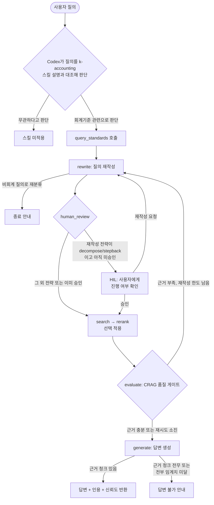

# 회계 기준서 RAG 시스템

이 프로젝트는 회계 기준서에 대한 질의응답을 위해 설계된 RAG(Retrieval-Augmented Generation) 시스템입니다. LangGraph를 활용한 에이전트 워크플로우를 통해 질문 분석, 문서 검색, 답변 생성 과정을 자동화합니다.

> **목적**: 본 프로젝트는 비영리·공익 목적으로 개발되었으며, 상업적 용도로 사용할 수 없습니다.

## 🚀 주요 기능

- **에이전트 워크플로우**: 질문 재작성(rewrite) → 검색(search) → 리랭킹(rerank, 기본 비활성) → 품질 평가(evaluate) → 답변 생성(generate)의 메인 경로 5단계 파이프라인
- **하이브리드 검색**: Dense(의미) 및 Sparse(키워드) 벡터를 결합한 고성능 검색
- **선택적 리랭킹**: Cross-Encoder 재정렬을 옵션으로 지원한다.
- **구조화된 답변**: Pydantic을 활용한 정제된 답변 출력

## 🛠️ 설치 및 실행

### 빠른 기동 (install.sh / check.sh)

서버 구성: **임베딩 모델(KURE-v1)은 TEI 컨테이너로 분리**하고, **앱 컨테이너 하나가 FastAPI API와 빌드된 React 프론트를 함께 서빙**합니다. PostgreSQL(pgvector)은 별도 데이터베이스 컨테이너입니다. 리랭커는 `USE_RERANKER` 기본 off라 서빙 대상이 아니며, 기본 이미지에도 포함하지 않습니다(opt-in 시 `--extra reranker`로 재빌드).

```bash
cp .env.example .env   # 최초 1회, OPENAI_API_KEY 등 입력
./install.sh           # docker(database·embedding·app) 빌드 및 기동
./check.sh             # 시스템 점검 (무변경)
```

브라우저 진입점은 http://localhost:8000 이고, API 문서는 http://localhost:8000/docs 입니다.

아래는 각 단계를 수동으로 수행하는 방법입니다.

### 1. 환경 설정 및 의존성 설정

프로젝트 루트 디렉토리에서 가상 환경을 생성하고 활성화합니다.
uv 사용을 권장합니다.

```bash
uv sync
```

기본 설치는 Docker의 TEI 임베딩 서버를 사용하며, 앱/query 실행에 필요한 의존성만 설치합니다. PDF 파싱 적재나 로컬 모델 임베딩을 쓸 때만 extra를 추가합니다.

```bash
uv sync --extra ingest           # --pdf ingest / Docling 파싱 경로
uv sync --extra local-embedding  # EMBEDDING_SERVER_URL 없이 로컬 KURE-v1 직접 로드
```

### 2. 데이터베이스 기동

pgvector 확장이 포함된 PostgreSQL을 docker compose로 기동합니다.
접속 정보는 `.env`(템플릿: `.env.example`)에서 읽습니다.

```bash
docker compose up -d database
```

### 3. 실행

진입점 `src/main.py`는 적재(`ingest`)와 질의(`query`) 두 경로를 제공합니다.

#### 문서 적재 (ingest)

미리 빌드된 온톨로지 그래프(`data/ontology/*.json`)를 청킹·임베딩하여 pgvector에 적재합니다.

> 📌 데이터 정책: `data/`(회계기준 원문·파생)는 **BYO(Bring Your Own)** 방향으로 전환 중입니다 — 원본 PDF는 [data/raw_data/README.md](data/raw_data/README.md) 안내에 따라 각자 다운로드합니다.
> 컨테이너의 `data/raw_data` 마운트는 PDF 서빙용 read-only입니다. 문서 적재(`ingest`)는 `uv sync --extra ingest`를 설치한 호스트에서 실행하는 전제입니다.

```bash
# data/ontology 전체 장을 적재 (검색기와 동일한 chunks 테이블에 저장)
uv run python -m src.main ingest

# 컬렉션을 비우고 새로 적재
uv run python -m src.main ingest --reset

# 단일 PDF에서 파싱 → 온톨로지 빌드 → 청킹·적재까지 전체 경로
uv run python -m src.main ingest --pdf data/raw_data/제6장.pdf --standard-id gaap-ch6 --standard-type GAAP
```

#### 질의 (query)

적재된 데이터를 기반으로 워크플로(rewrite → search → rerank → evaluate → generate)를 실행해 답변과 인용을 출력합니다.

```bash
uv run python -m src.main query "금융자산의 최초 인식 시점은?"
uv run python -m src.main query "리스 회계처리" --standard GAAP
```

> 컨테이너(`app`) 안에서 실행하려면 `docker compose exec app uv run python -m src.main ...` 형태로 호출합니다.

#### 웹 화면 (FastAPI + React)

컨테이너 기동 시 앱 서버가 API와 React 정적 파일을 함께 제공합니다.

```bash
docker compose up -d --build
open http://localhost:8000
```

호스트에서 프론트 개발 서버를 따로 띄울 때만 Vite를 사용합니다. 이 경우 `frontend/vite.config.ts`가 `/query`, `/resume`, `/documents`를 `localhost:8000`으로 프록시합니다.

```bash
uv run uvicorn src.api.server:app --host 0.0.0.0 --port 8000
cd frontend && npm install && npm run dev
```

> 기존 Streamlit 화면(`app.py`)은 React가 동일 기능(질의·조항 표시·HIL 왕복)을 대체하면서 **유지보수 동결(deprecated)** 상태입니다 — 신규 기능은 React에만 추가하며, 제거 시점은 v1.1에서 결정합니다.

#### MCP 서버 (FastMCP)

RAG 질의를 MCP 도구로 노출합니다(`src/mcp_server/server.py`, stdio). 도구는 `query_standards`(질의)와 `resume_query`(HIL 재개) 2종이며 응답 스키마는 API(`/query`·`/resume`)와 동일합니다.

```bash
# MCP 클라이언트 등록 (stdio, 프로젝트 루트에서)
claude mcp add accounting-rag -- uv run python -m src.mcp_server.server
```

> DB·임베딩 서버가 떠 있어야 합니다(`docker compose up -d database embedding`). 임베딩을 TEI로 위임하려면 `EMBEDDING_SERVER_URL=http://localhost:8080`을 설정합니다.

Claude Code용 스킬도 함께 제공됩니다 — `.claude/skills/k-accounting/`이 저장소에 포함되어 있어, 이 저장소 디렉토리에서 Claude Code를 열면 회계 질의에서 자동으로 활성화됩니다. 스킬은 위에서 등록한 `accounting-rag` 도구를 호출하므로 **`claude mcp add` 등록이 선행되어야** 동작합니다.

#### Codex 플러그인

비상장 중소기업 감사에 투입되면 K-GAAP(한국의 일반기업회계기준 — 상장사가 쓰는 K-IFRS와 별도로 비상장 중소기업에 적용되는 기준)에서 K-IFRS와 다르게 규정한 회계처리를 빠르게 확인해야 합니다. K-GAAP은 공인회계사 시험 과정에서 깊게 다루지 않아 실무 투입 시 조항 자체가 낯설고, 조항 수가 많아 "이 거래에 정확히 어떤 조항이 적용되는가"를 원문에서 장별로 하나씩 찾아보는 데 시간이 걸립니다. Codex 플러그인은 이 탐색을 대화 중 질의 한 번으로 줄여줍니다.

MCP 서버와 달리 Codex는 플러그인을 마켓플레이스 경유로 설치합니다. 이 저장소 전체가 마켓플레이스이고, 그 안의 `src/`가 플러그인 루트입니다.
```bash
# 플러그인 등록 (저장소 루트에서, 최초 1회)
codex plugin marketplace add .
codex plugin add k-accounting@k-accounting-marketplace
```

> MCP 서버(`src/mcp/server.py`)는 플러그인에 번들되어 있어 위 설치만으로 함께 등록됩니다 — Claude처럼 `mcp add`를 별도로 실행할 필요가 없습니다. DB·임베딩 서버가 떠 있어야 하고(`docker compose up -d database embedding`), **Codex 세션은 이 저장소 루트에서 열어야 합니다**.

설치 후 동작 절차는 다음과 같습니다.



- 스킬 트리거는 키워드 매칭이 아니라, Codex가 질의와 `SKILL.md`의 `description`을 대조해 판단하는 방식입니다. 같은 질의라도 매번 트리거를 보장하지는 않습니다.
- 사용자 확인(HIL)은 "질의가 모호해서"가 아니라, 재작성 전략이 질의를 쪼개거나(decompose) 상위 개념으로 추상화(stepback)해야 할 만큼 복잡하다고 판단됐을 때만 발생합니다.
- 질의 재작성(rewrite)은 `MAX_REWRITE_COUNT`회 한도로 수행됩니다. 이 한도는 최초 재작성을 포함한 총횟수라, 근거 부족으로 되도는 재검색은 그보다 한 번 적게 일어납니다. 근거 청크가 하나도 없거나 전부 임계치 미달이면 답변 불가를 안내하고, 하나라도 임계치를 넘으면 한도 소진 여부와 무관하게 그 근거로 답변을 생성합니다.
- 기존 단위·통합 테스트(`tests/unit/`, `tests/integration/`)와 벤치마크(`scripts/benchmark_baseline.py`)를 그대로 재사용합니다. 플러그인을 codex가 인식하는지, 스킬이 실제로 트리거되는지는 `codex` 바이너리가 필요해 [docs/Update/guides/codex_plugin_manual_checks.md](docs/Update/guides/codex_plugin_manual_checks.md)의 수동 체크리스트로 관리합니다.
- 스킬을 직접 호출하려면 Codex 세션에서 `/skills`를 입력하고 목록에서 `k-accounting`을 선택합니다.

### 4. (선택) LangSmith 트레이싱

케이스별로 파이프라인 노드 흐름·입출력·지연을 추적하려면 LangSmith 트레이싱을 켤 수 있습니다(개발자 디버깅용, 기본 OFF). `.env`에 아래 환경변수를 설정합니다.

```bash
LANGCHAIN_TRACING_V2=true
LANGCHAIN_API_KEY=ls-your-key-here   # 시크릿 — 레포에 커밋 금지
LANGCHAIN_PROJECT=rag-for-accounting # 트레이스가 모일 프로젝트명(선택)
```

- 활성화하면 LangGraph 노드(rewrite→search→rerank→evaluate→generate)와 CRAG 루프·HIL interrupt 분기가 노드 단위 트레이스로 기록됩니다.
- 벤치마크 측정 경로는 각 트레이스에 케이스 식별 메타데이터(`case_id`, `gold`)를 부착하므로, LangSmith UI에서 케이스별 필터링이 가능합니다.
- 키가 없거나 `LANGCHAIN_TRACING_V2`가 `true`가 아니면 트레이싱은 비활성이며 파이프라인은 동일하게 동작합니다.
- ⚠️ 활성화 시 질의·LLM 답변·검색 컨텍스트가 외부 SaaS(LangSmith)로 전송됩니다.

## 📂 프로젝트 구조

전체 문서 인덱스는 [docs/README.md](docs/README.md)에서 시작하세요. **현행 코드 모듈맵**은 [docs/architecture/architecture_overview.md](docs/architecture/architecture_overview.md)의 "모듈 지도(실제 구조)"를 참조합니다 — 단일 출처(SSoT)를 위해 구조를 여기서 중복 기재하지 않습니다.

## 📖 문서 학습

RAG 기술에 대한 자세한 학습 자료는 `docs/reference/rag_study.md` 파일에 정리되어 있습니다.

## 📝 진행 상황

앞으로의 계획·진행 상황은 GitHub [마일스톤](https://github.com/dongtan-91-dong-welfare-center/rag_for_accounting/milestones)·이슈가 정본입니다 — 레포·문서는 현재와 과거(아키텍처·결정·측정)를 다루고, 미래는 상태 드리프트를 막기 위해 GitHub에서만 관리합니다.


## 📚 데이터 출처

본 프로젝트에서 사용하는 회계기준 원문은 한국회계기준원이 공개한 자료입니다.

> 출처: 한국회계기준원 http://www.kasb.or.kr Copyright ©KAI all rights reserved.

## 📄 라이선스

이 프로젝트는 MIT 라이선스를 따릅니다.
